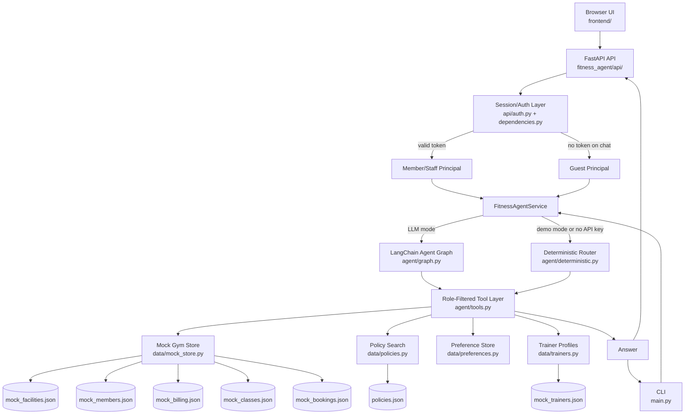

# Fitness Front Desk Agent Architecture

This project is a runnable V1 scaffold for a fitness-centre front desk agent. It supports public guest questions, authenticated member questions, and staff-only workflows from one codebase while keeping tool access tied to a server-created `Principal`.

## Current Capabilities

- Guest users can ask public questions using green-tier tools only.
- Members can read their own membership, billing, bookings, preferences, and public data.
- Staff users can access staff-only tools such as member lookup and class occupancy.
- The LangChain path uses `create_agent()` with role-filtered tools.
- The deterministic path provides a no-LLM fallback for local demos and tests.
- Mock gym data and policy clauses live in JSON fixtures under `fitness_agent/data/`, with exact dates in class and booking fixtures.
- Preference memory is separated from the gym system of record and guarded by a closed-vocabulary capture gate.

## Architecture Diagram

## Request Flow

1. A browser or CLI message enters the app.
2. The API resolves the caller:
   - valid session token -> member or staff `Principal`
   - no token on chat -> guest `Principal`
3. `FitnessAgentService` chooses the response mode:
   - LLM mode when configured and credentials are available
   - deterministic mode for offline demo/test behavior
4. The tool layer builds only tools visible to that principal.
5. Tools call data boundaries:
   - `MockGymStore` for live gym facts
   - policy search for cited rules
   - preference store for stated member preferences
6. The answer returns through the same API/CLI surface.

## Tool Access

Tool visibility is code-enforced in `fitness_agent/agent/tools.py`.

| Role | Visible Tools |
| --- | --- |
| Guest | `search_policies`, `get_facility_info`, `list_class_schedule`, `escalate_to_human` |
| Member | Guest tools plus own membership, billing, bookings, booking preparation, preferences |
| Staff | Guest tools plus `lookup_member`, `get_member_membership`, `get_member_billing_summary`, `get_member_bookings`, `get_member_preferences`, and `get_class_occupancy` |

Sensitive member tools do not accept a model-supplied `member_id`. They use the authenticated `Principal`. Staff tools are explicit target-member tools and should be audited.

## Memory Model

The project intentionally keeps memory types separate:

| Memory/Data Type | Owner | Purpose |
| --- | --- | --- |
| Gym store | `data/mock_store.py` + JSON fixtures | Source of truth for membership, billing, classes, bookings |
| Policy corpus | `data/policies.py` + `policies.json` | Cited answers for rules and public policy |
| Preference store | `data/preferences.py` + `fitness_agent.preferences.local.json` | Stated user preferences only |
| LangGraph checkpointer | `agent/service.py` + `agent/graph.py` | Conversation state and future write-interrupt state |

The current checkpointer is shared by a running `FitnessAgentService`, but it is still in-memory and suitable for local development only. Production write confirmation should use a persistent checkpointer.

## Current Boundaries

- Guest access is anonymous. `guest` is not a login role.
- Demo credentials may create only member or staff sessions and prefer PBKDF2 password hashes. Local config supports both a legacy single `[demo_auth]` user and multiple `[demo_users]`.
- Booking tools currently prepare/validate but do not persist a booking.
- Preference writes are allowed only through `remember_preference()` and deterministic validation.
- Medical, injury, BMI, body measurement, and clinical nutrition requests are refused or redirected.
- Persistence importance is defined in `fitness_agent/persistence.py`; important events should be saved immediately rather than waiting for periodic chat snapshots.

## Next Architecture Steps

- Add persistent checkpointer for confirmed write flows.
- Split booking into prepare, confirm/interruption, and commit stages.
- Replace JSON preference storage with a database-backed implementation.
- Add durable audit logging for yellow/red tools.
- Add per-browser guest thread IDs if guest chat should retain temporary conversation context.
